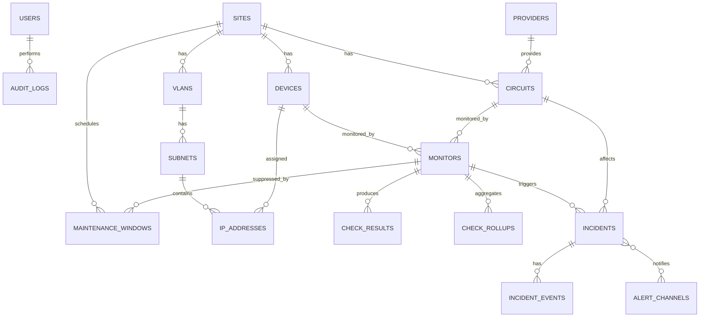

# NetWatch — Entity Relationship Diagram (v1 draft)

Relationships only — full column lists are introduced as each cluster is implemented (see [`DESIGN.md`](../DESIGN.md) § Roadmap). Only `users` and `audit_logs` exist as migrations this week; the rest is the planning draft for Weeks 2–6.

## Entity clusters

- **Identity & audit** — `USERS`, `AUDIT_LOGS`
- **Inventory** — `SITES`, `VLANS`, `SUBNETS`, `IP_ADDRESSES`, `DEVICES`
- **Circuits** — `PROVIDERS`, `CIRCUITS`
- **Monitoring** — `MONITORS`, `CHECK_RESULTS`, `CHECK_ROLLUPS`, `MAINTENANCE_WINDOWS`
- **Incident management & alerting** — `INCIDENTS`, `INCIDENT_EVENTS`, `ALERT_CHANNELS`

See the full field-level table in the project plan (`NetWatch Project Plan.md` § 6) for column-level detail as each cluster is built out.
