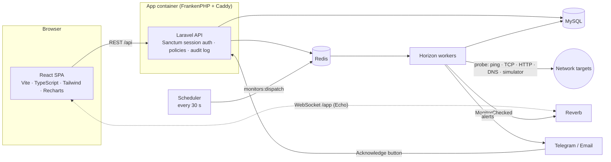

# NetWatch architecture

## System



## One check, end to end

```mermaid
sequenceDiagram
    participant S as Scheduler
    participant D as monitors:dispatch
    participant Q as Redis queue "checks"
    participant W as Horizon worker
    participant E as StatusEvaluator
    participant I as IncidentService
    participant B as Reverb
    participant A as Alert channels

    S->>D: every 30 s
    D->>D: claim due monitors (compare-and-set on next_check_at)
    D->>Q: one RunCheck job per monitor
    Q->>W: RunCheck
    W->>W: probe (ping / TCP / HTTP / DNS / simulator)
    W->>W: store raw check_result
    W->>E: apply(result)
    E->>E: lock monitor row, update counters, flap-protected state change
    E->>B: MonitorChecked (every check; flags state flips)
    E->>I: sync(monitor)
    alt monitor is Down, no open incident, not in maintenance
        I->>A: open incident → Telegram (with Acknowledge button) / email
    else monitor recovered
        I->>A: auto-resolve (Detected / Acknowledged / Investigating) → "resolved" alert
    end
```

## Design decisions worth knowing

**Flap protection is a state machine, not a filter.** `StatusEvaluator` counts consecutive results per monitor: 3 failures to go Down, 2 passes to recover (both configurable per monitor). A single dropped probe changes nothing, and the simulator's `flapping` scenario (two failures, one pass, repeating) demonstrably never opens an incident. The counters are updated under a row lock so a manual "Run now" cannot race a scheduled check.

**Claiming work is a compare-and-set.** The dispatcher moves each monitor's `next_check_at` forward with `UPDATE … WHERE next_check_at = <value it read>` and only queues the job if a row changed, so overlapping scheduler ticks can never queue the same check twice. All monitors in a run share one tick timestamp; claiming each at its own `now()` pushed later monitors just past the next tick and doubled their interval (found and fixed while load-testing 50 monitors).

**Raw results are short-lived; rollups are permanent.** Raw `check_results` are pruned after 14 days. `checks:rollup` writes idempotent 5-minute and hourly buckets (checks, failures, average, nearest-rank p95) from closed buckets only. Charts and SLA both read rollups, so a month-long SLA report does not depend on data that has been pruned.

**SLA excludes maintenance at bucket granularity.** A circuit's availability sums the 5-minute rollups of every monitor linked to it, dropping any bucket that overlaps a maintenance window covering that monitor (directly, or via its circuit). Planned work counts neither for nor against the circuit. The cost of using rollups is precision: a window edge inside a bucket excludes the whole bucket.

**The incident state machine is enforced in one place.** `IncidentState::allowedNext()` defines the legal moves (see [`incident-states.md`](incident-states.md)); `IncidentService::transition()` is the only code that changes state, under a row lock, and writes an `incident_events` row for every move. That table is the source for MTTA/MTTR. A recovering monitor auto-resolves an incident only from Detected/Acknowledged/Investigating; an incident escalated to a provider waits for a person.

**Alerts are queued per channel and fail independently.** One job per (channel, incident), three tries with backoff, so a dead Telegram token does not block email. The bot token is redacted from any exception message (Guzzle puts the request URL, and so the token, in its errors).

**The Telegram button is authenticated twice.** The webhook requires the secret header Telegram echoes back (and fails closed if none is configured), and a press is honoured only if it comes from a chat that is an enabled alert channel: anyone can message a public bot.

**Maintenance suppresses incidents, not checks.** Monitors keep being probed during a window (so the data is real), but no incident or alert opens. Because the incident check runs on every failure of a Down monitor, a link that was already down when its window ended gets an incident on the next check.

**Live updates are one small event.** `MonitorChecked` (id, state, latency, timestamps, maintenance flag) goes out on a private channel after every check; the Status board patches its list from it. Channel auth goes through the normal Sanctum session.

**A simulator probe makes the public demo honest.** Scripted scenarios are a pure function of the clock and monitor id: no state, no network, identical for every visitor, and they run through the *real* evaluator, incident and alert code paths.
