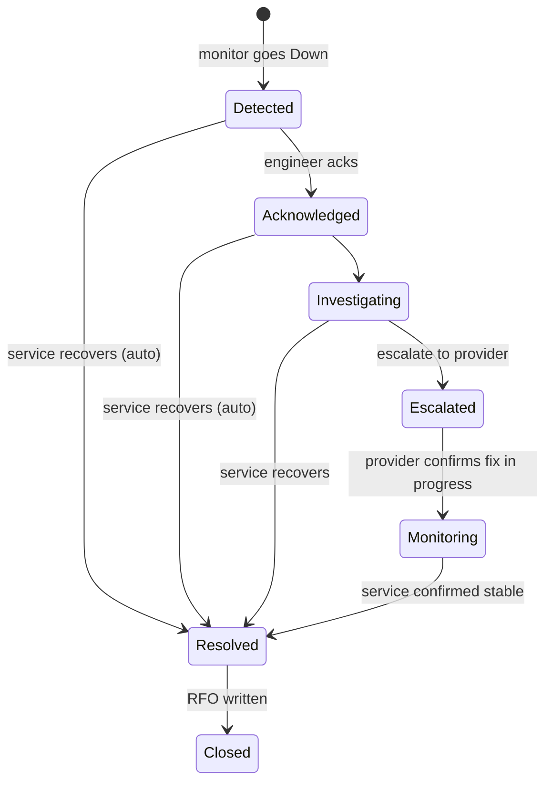

# NetWatch — Incident State Machine (reference only)

> **Not implemented yet.** This documents the intended design for Week 6 ("Incidents & alerts"). No `incidents`/`incident_events` migrations or state-transition code exist this week.

Every transition writes an `incident_events` row (`from_state`, `to_state`, `user_id`, `note`, `created_at`) for MTTA (time to Acknowledged) and MTTR (time to Resolved) metrics. Illegal transitions (e.g. `Detected → Closed`) are rejected in the service layer, not the database.
