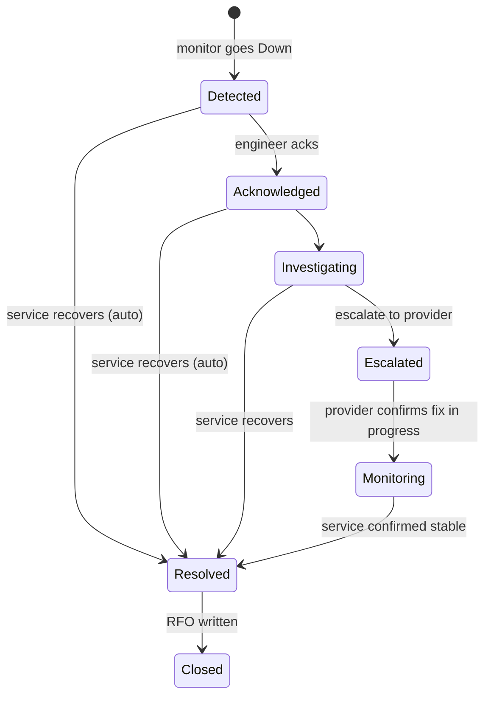

# NetWatch — Incident State Machine

> **Implemented (Week 6).** The legal moves live in `App\Enums\IncidentState::allowedNext()`; `App\Services\IncidentService::transition()` is the only code that changes an incident's state.

Every transition writes an `incident_events` row (`from_state`, `to_state`, `user_id`, `note`, `created_at`) for MTTA (time to Acknowledged) and MTTR (time to Resolved) metrics. Illegal transitions (e.g. `Detected → Closed`) are rejected in the service layer with a 422, not the database.

## Rules as built

- **Opening:** a monitor that goes Down (after flap protection) gets an incident unless it is under maintenance. At most one open incident per monitor. Incidents on circuit-linked monitors are `critical`, others `major`.
- **Auto-resolve:** when the monitor comes back Up, incidents in Detected, Acknowledged or Investigating resolve by themselves. An **Escalated** incident waits for a person (the provider owns the fix); **Monitoring** waits for someone to confirm it is stable.
- **Closing** requires the RFO summary to be written. A closed incident is a record and cannot be edited.
- **Acknowledging from Telegram** is `Detected → Acknowledged` with `user_id = null` and the Telegram username in the note. If the incident has already moved on, the button reports its current state instead of failing.
- **Alerts** go out on open (with an Acknowledge button) and on resolve, to every enabled channel.
